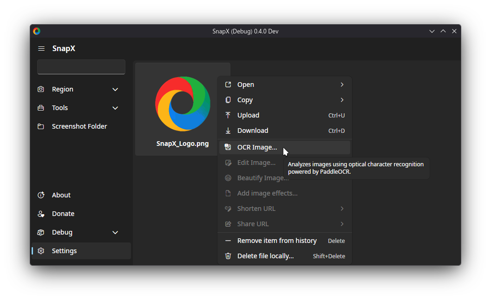

<h1 align="center">SnapX</h1>
<h3 align="center">Capture, share, and boost productivity. All in one.</h3>
 

  
  
  
  
   
   
  
  
   
  
  
  

 

> [!CAUTION]
> **This project is _under development_ and is _not_ ready for use.**

> [!NOTE]
> **DISCLAIMER:** SnapX is a [hard fork](https://producingoss.com/en/forks.html) of the Windows application [ShareX](https://github.com/ShareX/ShareX).

## Feature-wise

- SnapX is a cross-platform application.
- Elegance in user interfaces by separating essential settings from advanced or intermediate functionality
- Supporting high DPI screens
- Screenshots on an HDR monitor aren't blown out[1]
- Cross-platform OCR powered by [**PaddleOCR**](https://github.com/PaddlePaddle/PaddleOCR) for industry-leading precision. Experience accuracy that [**outperforms**](https://github.com/opendatalab/OmniDocBench?tab=readme-ov-file#end-to-end-evaluation) PowerToys OCR, ShareX, Tesseract, and Window's built in OCR.

> [1] When tested on KDE Plasma Wayland 6.2.90 with HDR, the resulting screenshots' colors were not blown out. Your mileage may vary.

## Technical Details

- It uses [.NET 10](https://learn.microsoft.com/en-us/dotnet/core/whats-new/dotnet-10/overview), [ImageSharp](https://docs.sixlabors.com/articles/imagesharp/?tabs=tabid-1) (cross-platform image library).
- It uses [SQLite](https://www.sqlite.org/about.html) for [image metadata like image hashes & history](https://github.com/SnapXL/SnapX/issues/28).
- The UI is now defined in a more modern, declarative style using MVVM and XAML, providing a clear improvement over the older WinForms approach.
- UI is GPU-accelerated, leading to a more responsive UI & yet less CPU usage while navigating the UI. (Fixes low performance on 4K screens with a weak CPU).
- Respects [XDG directory specification](https://specifications.freedesktop.org/basedir-spec/latest/), Symlinks ~/Documents/SnapX to respective config/data directory on Linux/macOS.
- Uses [Direct3D11](https://learn.microsoft.com/en-us/windows/win32/direct2d/comparing-direct2d-and-gdi) & [WinRT](https://learn.microsoft.com/en-us/windows/apps/develop/platform/csharp-winrt/) to capture on Windows, [XCap](https://github.com/nashaofu/xcap) on macOS, and [XDG Portals](https://flatpak.github.io/xdg-desktop-portal/) on Linux.
- Supports PNG (including animated variant), WEBP (including animated variant), AVIF, JPEG, GIFs (should be smaller than your typical ShareX GIF), TIFF, and BMP image formats.
- Supports 95% of ShareX uploaders (we're a fork!).
- Supports Google Photos Image Uploader after the [new API change](https://developers.googleblog.com/en/google-photos-picker-api-launch-and-library-api-updates/).
- The ability to fully configure SnapX via the Command Line via command flags & environment variables. Additionally, you can configure SnapX using the Windows Registry.
- Additionally, all uploaders are now encouraged to use HTTPS <2.0 & *optionally* use TLS 1.3.
- Keeps compatibility with the custom uploader configuration format (.sxcu).
- As a user, you do **NOT** need to have .NET installed. Whether you're on Linux, Windows, macOS, or FreeBSD.

What does this all mean? It means you'll be able to have a more **performant**, **reliable**, and **stylish** application.

You will *not* receive any support from the ShareX project for this software. \
If you have any issues with this project or would like us to add any new feature, please **open an issue** in this repository or use the [`#development`](https://discord.com/channels/1267996919922430063/1404876855861051562) channel in our [Discord](https://discord.gg/ys3ZCzttVQ).

## Supported Linux Distributions

This project is built on Ubuntu 24.04 and is tested on the following distributions:

- **Fedora 42+** 
- **Ubuntu 24.04+** 

> [!NOTE]
> If you're using a different distribution, there will be a Flatpak package available when possible. If you're using a distribution that doesn't support Flatpak, you can [build the project from source](#building-from-source).

## Supported Desktop Environments

This application relies on XDG portals to handle screenshots in a secure and desktop-agnostic way. It is actively tested on:

- **KDE Plasma**
- **GNOME**

> [!TIP]
> Other desktop environments or Wayland compositors—such as Budgie, Cinnamon, MATE, Hyprland, and any others that implement the necessary screenshot portal—should also work, but are not officially tested.

## Testing

SnapX is not yet in a usable state. Packages are provided for making testing easier.

See our guide here to learn [how to test](https://github.com/SnapXL/SnapX/wiki/Testing).

SnapX is packaged on:

- [AUR](https://aur.archlinux.org/packages/snapx-ui)
<!-- - [Flathub](https://flathub.org/en/apps/io.github.SnapXL.SnapX) [PENDING] -->
- [My Homebrew Tap](https://github.com/BrycensRanch/homebrew-repo)
- [Snapcraft](https://snapcraft.io/ui-snapx)

Additionally, you can download nightly builds from [here](https://nightly.link/SnapXL/SnapX/workflows/build/develop?preview).

## Building & Contributing

Contributions are welcome.
See [BUILDING.md](./.github/BUILDING.md) for build instructions.

The documentation for contributing can be found [here](./.github/CONTRIBUTING.md).

## Donators 💖

- [Rsslone (Tommy)](https://github.com/Rsslone)
- [Skorlok](https://github.com/Skorlok)
- [Abdullah16M](https://github.com/Abdullah16M)

**Thank you so much!** People like you are the reason why this project is possible. For anyone interested in financially contributing, donate via [Liberapay](https://liberapay.com/BrycensRanch)!

## Roadmap

See [`Progress.md`](./.github/Progress.md).
