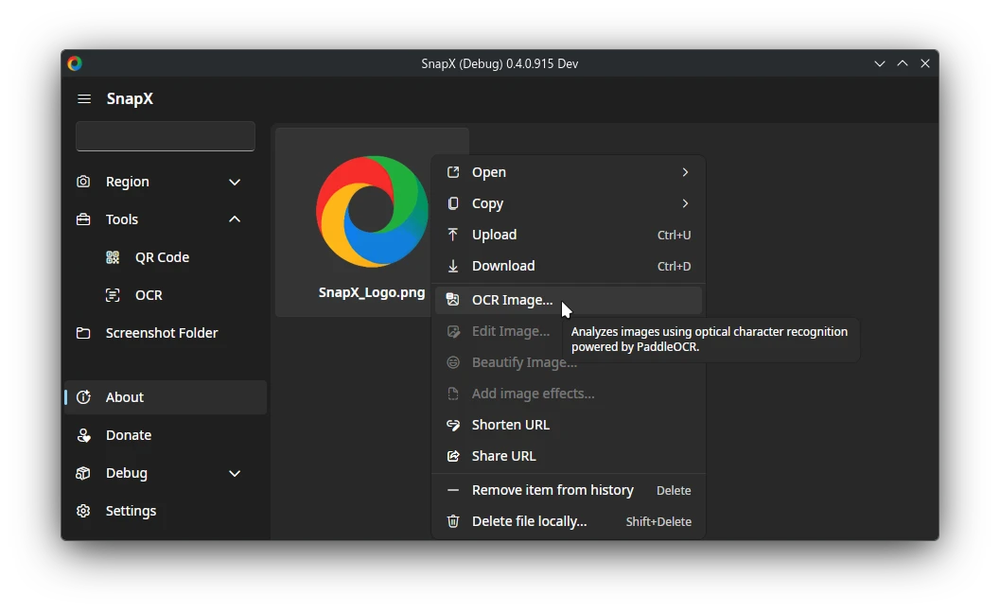

  

<h1 align="center">SnapX</h1>
<h3 align="center">Capture, share, and boost productivity. All in one.</h3>
<h3 align="center">Built on the foundations of <a href="https://getsharex.com">ShareX</a>, made cross-platform. </h3>

  <b>Everything you love, engineered for speed. User-centric. Native. Powerful. </b>

 

  
  
  
  
   
   
  
  
  
  
  
   
  
  
  

 

> [!CAUTION]
> SnapX is in **_Early Access_**.
> The core capture and upload engine is stable and ready for daily use. However, the Image Editor is still in the works.

## Feature-wise

[//]: # (- Elegance in user interfaces by separating essential settings from advanced or intermediate functionality)
- Supporting high DPI screens
- Screenshots on an HDR monitor aren't blown out[1]
- Cross-platform OCR powered by [**PaddleOCR**](https://github.com/PaddlePaddle/PaddleOCR) for industry-leading precision. Experience accuracy that [**outperforms**](https://intuitionlabs.ai/articles/non-llm-ocr-technologies#paddleocr--industrial-grade-deep-ocr-baidu) PowerToys OCR, ShareX, Tesseract, and Windows' built in OCR.

> [1] When tested on KDE Plasma Wayland 6.2.90 with HDR, the resulting screenshots' colors were not blown out. Your mileage may vary.

## Supported Desktop Environments

This application relies on XDG portals to handle screenshots in a secure and desktop-agnostic way. It is actively tested on:

- **KDE Plasma** 
- **GNOME** 

We also use direct X11 screenshot capture on X based environments.

> [!TIP]
> Other desktop environments or Wayland compositors, like Budgie, Cinnamon, MATE, Hyprland, and any others that have the right screenshot portal, should work, but they haven't been officially tested.

## Packaging

See our quick start testing guide here to learn [how to test](https://github.com/SnapXL/SnapX/wiki/Testing) SnapX.

SnapX is packaged on:

<!-- - [Flathub](https://flathub.org/en/apps/io.github.SnapXL.SnapX)  [PENDING] -->

- **AUR:** [`snapx-ui`](https://aur.archlinux.org/packages/snapx-ui) 
- **Snapcraft:** [`ui-snapx`](https://snapcraft.io/ui-snapx) 
- **Homebrew:**  [BrycensRanch/homebrew-repo](https://github.com/BrycensRanch/homebrew-repo) 
- **DEB/RPM Repo:** [Setup Instructions](https://github.com/SnapXL/SnapX/wiki/Adding-DEB-RPM-repository)

**Flatpak** (Flathub pending)
- **x86_64:** [Download](https://nightly.link/SnapXL/SnapX/workflows/build/develop/io.github.SnapXL.SnapX-x86_64.flatpak)
- **aarch64:** [Download](https://nightly.link/SnapXL/SnapX/workflows/build/develop/io.github.SnapXL.SnapX-aarch64.flatpak)

Additionally, you can download nightly builds from [here](https://nightly.link/SnapXL/SnapX/workflows/build/develop?preview).

## Technical Details

- It uses [.NET 10](https://learn.microsoft.com/en-us/dotnet/core/whats-new/dotnet-10/overview) and [ImageSharp](https://docs.sixlabors.com/articles/imagesharp/?tabs=tabid-1) (cross-platform image library).
- It uses [SQLite](https://www.sqlite.org/about.html) for [image metadata like image hashes & history](https://github.com/SnapXL/SnapX/issues/28).
- UI is GPU-accelerated, leading to a more responsive UI & yet less CPU usage while navigating the UI. (Fixes low performance on 4K screens with a weak CPU)
- Respects [XDG directory specification](https://specifications.freedesktop.org/basedir-spec/latest/), Symlinks ~/Documents/SnapX to respective config/data directory on Linux/macOS.
- Uses [Direct3D11](https://learn.microsoft.com/en-us/windows/win32/direct2d/comparing-direct2d-and-gdi) & [WinRT](https://learn.microsoft.com/en-us/windows/apps/develop/platform/csharp-winrt/) to capture on Windows, [XCap](https://github.com/nashaofu/xcap) on macOS, and [XDG Portals](https://flatpak.github.io/xdg-desktop-portal/) on Linux.
- Supports PNG (including animated variant), WEBP (including animated variant), AVIF, JPEG, GIFs (should be smaller than your typical ShareX GIF), TIFF, and BMP image formats.
- Supports 95% of ShareX uploaders (we're a fork!).
- Allows you to fully configure SnapX via the Command Line via command flags & environment variables. Additionally, you can configure SnapX using the Windows Registry.
- Keeps compatibility with the custom uploader configuration format (.sxcu).
- As a user, you do **NOT** need to have .NET installed. Whether you're on Linux, Windows, macOS, or FreeBSD.

[//]: # (- Supports Google Photos Image Uploader after the [new API change]&#40;https://developers.googleblog.com/en/google-photos-picker-api-launch-and-library-api-updates/&#41;.)

What does this all mean? It means you'll be able to have a more **performant**, **reliable**, and **stylish** application.

You will *not* receive any support from the ShareX project for this software. \
If you have any issues with this project or would like us to add any new feature, please **open an issue** in this repository or use the [`#development`](https://discord.com/channels/1267996919922430063/1404876855861051562) channel in our [Discord](https://discord.gg/ys3ZCzttVQ).

## Building & Contributing

Contributions are welcome.
See [`BUILDING.md`](./.github/BUILDING.md) for build instructions.

The documentation for contributing can be found at [`CONTRIBUTING.md`](./.github/CONTRIBUTING.md).

## 🤝 Real People. Real Code. Soul. 💖

Free-range, organic, non-GMO, and locally sourced developers. This code was created without causing any damage to any GPUs.

  <h3>👨‍💻 Espresso Consortium</h3>
    
<em>Turning caffeine into code, and bugs into features.</em>

    
The architects, packagers, documentation writers, debuggers, and morning birds currently building SnapX.

  <table border="0">
    <tr>
      <td align="center" width="150">
        <a href="https://github.com/BrycensRanch">
          <b>BrycensRanch (Lead)</b>
           
          
        </a>
      </td>
      <td align="center" width="150">
        <a href="https://github.com/ok-coder1">
          <b>ok-coder1 (Team)</b>
           
          
        </a>
      </td>
      <td align="center" width="150">
        <a href="https://github.com/Rune580">
          <b>Rune580</b>
           
          
        </a>
      </td>
      <td align="center" width="150">
        <a href="https://github.com/norz3n">
          <b>norz3n</b>
           
          
        </a>
      </td>
    </tr>
  </table>

  <h3>💸 The Caffeine & Infrastructure Cartel</h3>
  
These charitable people support our early morning server maintenance and coding sessions. Their donations literally keeps the lights on and the compilers warm.

  <table border="0">
    <tr>
      <td align="center" width="150">
        <a href="https://github.com/Rsslone">
          <b>Rsslone (Tommy)</b>
           
          
        </a>
      </td>
      <td align="center" width="150">
        <a href="https://github.com/Skorlok">
          <b>Skorlok</b>
           
          
        </a>
      </td>
      <td align="center" width="150">
        <a href="https://github.com/Abdullah16M">
          <b>Abdullah16M</b>
           
          
        </a>
      </td>
    </tr>
  </table>

 

  <h3>🔬 Battle-tested by a select few</h3>
  
Our code isn't compiled. It's <strong>dry-aged</strong>.

  
"Hallucinated" bug fixes are not what we do. We use a more conventional approach: look at a stack trace until someone breaks down in tears.

  
SnapX was built by the brave ones who wiped their eyes… and kept clicking.

<table border="0">
  <tr>
    <td align="center" width="120">
      <a href="https://discord.com/users/164445443680370688">
        <b>Horo</b>
         
        
      </a>
    </td>
    <td align="center" width="120">
      <a href="https://discord.com/users/182579271095681024">
        <b>Freako95</b>
         
        
      </a>
    </td>
    <td align="center" width="120">
      <a href="https://discord.com/users/182674215424622592">
        <b>トミー (tommy.sama)</b>
         
        
      </a>
    </td>
    <td align="center" width="120">
      <a href="https://discord.com/users/224868029610197002">
        <b>Tobi</b>
         
        
      </a>
    </td>
    <td align="center" width="120">
      <a href="https://discord.com/users/277518977033437185">
        <b>Skorlok</b>
         
        
      </a>
    </td>
  </tr>
  <tr>
    <td align="center" width="120">
      <a href="https://discord.com/users/354370875878801419">
        <b>Tape1</b>
         
        
      </a>
    </td>
    <td align="center" width="120">
      <a href="https://discord.com/users/362670720972619777">
        <b>Ione 15</b>
         
        
      </a>
    </td>
    <td align="center" width="120">
      <a href="https://discord.com/users/474221560031608833">
        <b>Lee</b>
         
        
      </a>
    </td>
    <td align="center" width="120">
      <a href="https://discord.com/users/615785223296253953">
        <b>Tari</b>
         
        
      </a>
    </td>
    <td align="center" width="120">
      <a href="https://discord.com/users/677619920657317936">
        <b>revolume</b>
         
        
      </a>
    </td>
  </tr>
  <tr>
    <td align="center" width="120">
      <a href="https://discord.com/users/821472922140803112">
        <b>Luna</b>
         
        
      </a>
    </td>
  </tr>
</table>

## Roadmap

See [`Progress.md`](./.github/Progress.md).
